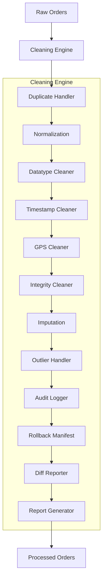
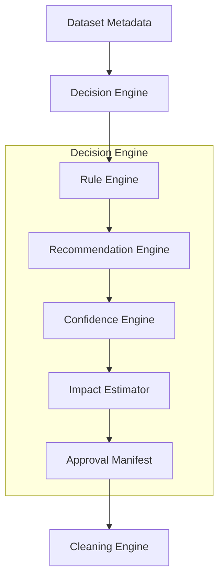
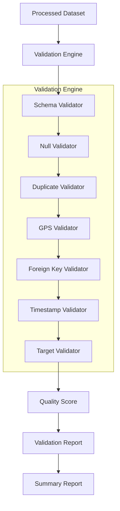

# ETAIQ

[](https://github.com/ETAIQ)
[](https://www.python.org/)
[](https://fastapi.tiangolo.com/)
[](#license)

AI-Powered ETA Prediction Platform for Quick Commerce.

ETAIQ is a data-quality-first prototype for delivery ETA intelligence. The current repository implements the backend data pipeline, decision engine, cleaning engine, validation engine, and supporting reports with a focus on auditability and dataset integrity.

---

## Table of Contents

- [Project Overview](#project-overview)
- [Problem Statement](#problem-statement)
- [Objectives](#objectives)
- [Features](#features)
  - [Implemented](#implemented)
  - [Planned](#planned)
- [Current Project Progress](#current-project-progress)
- [Current Data Snapshot](#current-data-snapshot)
- [System Architecture](#system-architecture)
  - [Mermaid Architecture](#mermaid-architecture)
  - [Text Architecture](#text-architecture)
- [Repository Structure](#repository-structure)
- [Technology Stack](#technology-stack)
- [Data Pipeline](#data-pipeline)
- [Decision Engine](#decision-engine)
- [Cleaning Engine](#cleaning-engine)
- [Validation Engine](#validation-engine)
- [Testing](#testing)
- [Reports Generated](#reports-generated)
- [Current Workflow](#current-workflow)
- [Installation](#installation)
# 🚚 ETAIQ – Explainable Delivery ETA Prediction System

[](https://github.com/ETAIQ)
[](https://www.python.org/)
[](#license)

ETAIQ is a data-quality-first codebase focused on preparing delivery datasets for future ETA prediction work. The repository implements a decision-driven cleaning pipeline, an audit-capable cleaning engine, and a comprehensive validation system that together produce verified, processed datasets and governance artifacts.

---

## 📌 Motivation

High-quality ETA prediction depends on reliable input data. In quick-commerce, raw delivery datasets frequently contain missing values, malformed timestamps, invalid GPS coordinates, duplicate records, and broken relationships between entities (orders, riders, restaurants). These issues produce biased analytics and unreliable model behavior.

ETAIQ focuses on the essential, production-grade task of transforming raw delivery data into validated, joinable, and auditable datasets suitable for later modeling and operational use.

---

## ✅ Project Objectives

Only implemented objectives are listed below.

- ✔ Decision Engine
- ✔ Cleaning Engine
- ✔ Validation Engine
- ✔ Reporting
- ✔ Rollback
- ✔ Automated Quality Assessment

---

## ⚙️ Current Features

Every completed feature implemented in this repository:

- Decision Engine
  - Approval manifest generation
  - Rule-based recommendations
  - Confidence scoring and impact estimation
- Cleaning Engine
  - Duplicate handling and removal
  - Missing-value imputation (config-driven)
  - Data type normalization
  - Timestamp normalization and correction
  - GPS validation and repair
  - Outlier detection and removal
  - Foreign key integrity cleaning for `orders` → `restaurants` / `riders`
  - Audit logging for each cleaning action
  - Rollback manifest generation (row-level original values)
  - Cleaning timeline and report generation
- Validation Engine
  - Schema validation
  - Null checks / required field validation
  - Duplicate checks
  - GPS validation
  - Foreign key validation
  - Timestamp validation
  - Target/label presence checks
- Reporting & Artifacts
  - Validation report
  - Cleaning report
  - Timeline report
  - Rollback manifest
  - Quality summary report

---

## 🔁 System Workflow

The implemented pipeline follows this sequence:

Raw Dataset
↓
Decision Engine
↓
Cleaning Engine
↓
Validation Engine
↓
Processed Dataset
↓
Reports

Each stage emits artifacts consumed by the next stage and stores governance artifacts to support audit and traceability.

---

## Current System Architecture

```mermaid
flowchart TD
  A[Raw CSV Datasets] --> DE[Decision Engine]

  subgraph DecisionEngine [Decision Engine]
    de1[Rule Engine]
    de2[Recommendation Engine]
    de3[Confidence Engine]
    de4[Impact Estimator]
    de5[Approval Manifest]
  end

  DE --> CE[Cleaning Engine]

  subgraph CleaningEngine [Cleaning Engine]
    ch1[Duplicate Handler]
    ch2[Normalization]
    ch3[Datatype Cleaner]
    ch4[Timestamp Cleaner]
    ch5[GPS Cleaner]
    ch6[Integrity Cleaner]
    ch7[Imputation]
    ch8[Outlier Handler]
    ch9[Audit Logger]
    ch10[Rollback]
    ch11[Diff Reporter]
    ch12[Report Generator]
  end

  CE --> VE[Validation Engine]

  subgraph ValidationEngine [Validation Engine]
    v1[Schema Validator]
    v2[Null Validator]
    v3[Duplicate Validator]
    v4[GPS Validator]
    v5[Foreign Key Validator]
    v6[Timestamp Validator]
    v7[Target Validator]
  end

  VE --> P[Processed Dataset]
  P --> R[Reports]

  %% internal flows
  DE --> de1 --> de2 --> de3 --> de4 --> de5
  CE --> ch1 --> ch2 --> ch3 --> ch4 --> ch5 --> ch6 --> ch7 --> ch8 --> ch9 --> ch10 --> ch11 --> ch12
  VE --> v1 --> v2 --> v3 --> v4 --> v5 --> v6 --> v7
  de5 --> CE
  ch12 --> VE
  v7 --> P
```



### Architecture Explanation

The repository is organized as a modular data pipeline:

- `Decision Engine` ingests dataset metadata and produces an `approval_manifest` describing cleaning actions to apply.
- `Cleaning Engine` executes the manifest, applying deterministic repairs and writing processed datasets along with detailed audit logs and a rollback manifest.
- `Validation Engine` runs a suite of validators against the processed outputs and computes a quantitative quality summary.
- `Reports` provide human- and machine-readable summaries of changes, timelines, and quality metrics.

All modules are implemented in the `ml/` package and are orchestrated by CLI and script entry points residing under `ml/` and `scripts/`.

---

## Cleaning Engine Architecture



### Modules (implemented)

- Cleaning Engine: orchestration layer executing cleaning steps in configured order and recording execution metadata.
- Duplicate Handler: detects and removes exact and near-duplicates using deterministic keys.
- Normalization: standardizes string cases, trims whitespace, and normalizes categorical values.
- Datatype Cleaner: coerces fields to target types (ints, floats, datetimes) with safe fallbacks.
- Timestamp Cleaner: parses multiple timestamp formats, detects impossible timestamps, and standardizes to UTC ISO format.
- GPS Cleaner: validates latitude/longitude ranges, snaps invalid coordinates to nearest valid placeholder when configured.
- Integrity Cleaner: enforces foreign key constraints, removes or flags orphan rows, and writes repair actions to the audit log.
- Imputation: fills missing values according to manifest rules (mode, median, constant) and marks imputed fields in metadata.
- Outlier Handler: flags and optionally removes extreme values based on configurable bounds.
- Audit Logger: records every transformation with row identifiers, original values, new values, and the rule applied.
- Rollback: materializes a rollback manifest containing original values and transformation metadata for each affected row.
- Diff Reporter: summarizes before/after deltas per table and per column.
- Executors: low-level components that run and persist transformation actions.
- Report Generator: produces cleaning reports, timelines, and CSV/JSON artifacts for review.
- Models: lightweight data classes for manifests, actions, and audit records (Pydantic-based).
- Config: centralizes cleaning rules, thresholds, and policy toggles.
- Logging: structured logs using the repository logging configuration.

Each module is intentionally small and focused to make unit testing straightforward and to support safe, auditable repairs.

---

## Decision Engine Architecture



### Modules (implemented)

- Approval Manifest: serializable manifest (JSON) describing the cleaning plan and permissions.
- Rule Engine: deterministic rule set that detects quality issues and maps them to repair actions.
- Recommendation Engine: suggests remediation options (drop, impute, repair) with rationale.
- Confidence Engine: attaches a confidence score to records and fields to guide repair aggressiveness.
- Impact Estimator: projects the effect of repair actions on dataset completeness and potential downstream joins.
- Utilities: helpers for statistics, sampling, and manifest generation.
- Models: schema definitions for manifest entries and decision artifacts.
- Config: operational parameters for decision thresholds and allowed actions.
- Report Generator: outputs a decision summary consumed by the cleaning engine and reviewers.

The Decision Engine is designed to separate policy (what to do) from execution (how to do it), enabling review and approval workflows.

---

## Validation Engine Architecture



### Modules (implemented)

- Validation Engine: orchestration layer that runs configured validators against processed datasets.
- Schema Validator: ensures required columns and types match `ml/validation/schemas.py` definitions.
- Null Validator: verifies non-null constraints for required fields.
- Duplicate Validator: checks for remaining duplicate records based on unique keys.
- GPS Validator: confirms latitude/longitude ranges and coordinate plausibility.
- Foreign Key Validator: asserts referential integrity for `orders.restaurant_id` and `orders.rider_id`.
- Timestamp Validator: validates timestamp formats and ordering rules.
- Target Validator: ensures the presence and basic sanity of any outcome/label fields used downstream.
- Schemas: central schema definitions used across validation and cleaning.

The Validation Engine computes per-validator pass/fail results and aggregates them into a final quality summary.

---

## 📁 Repository Structure

```
ETAIQ/
├── backend/             # FastAPI service (health endpoint, app lifecycle)
├── docker/              # Container definitions for local development (not used for deploy docs)
├── docs/                # Architecture diagrams and planning artifacts
├── frontend/            # UI scaffold (not implemented)
├── ml/                  # Core pipelines: decision, cleaning, validation, reports
│   ├── cleaning/
│   ├── validation/
│   ├── decision/
│   └── reports/
├── scripts/             # Local developer helpers (setup, test, lint)
├── data/                # Raw / processed datasets (ml/data/raw, ml/data/processed)
├── .env.example         # Environment template
├── Makefile             # Common commands
└── README.md
```

---

## 🧰 Technology Stack

| Category | Tools |
|---|---|
| Language | Python 3.11 |
| Data processing | pandas, NumPy |
| Validation models | Pydantic |
| Testing | pytest |
| Formats | JSON, CSV |
| Logging | structlog / standard logging |
| VCS | Git |

---

## 🧹 Data Cleaning Pipeline (Detailed)

Each cleaning stage is applied in sequence with audit logging and rollback support.

1. Duplicate Handler
  - Detects exact duplicate rows and removes them, preserving a record in the audit log.
2. Normalization
  - Standardizes text fields (case, whitespace), and categorical labels to canonical values.
3. Datatype Cleaner
  - Coerces columns to their schema types; on failure records are flagged for downstream handling.
4. Timestamp Cleaner
  - Parses multiple formats, coerces to timezone-aware UTC, and removes implausible timestamps.
5. GPS Cleaner
  - Validates lat/lon ranges, detects swapped coordinates, and marks invalid coordinates for repair or removal.
6. Integrity Cleaner
  - Validates and repairs foreign keys; orphan rows are either repaired (if feasible) or recorded and removed according to manifest rules.
7. Imputation
  - Applies manifest-driven imputation (mean/median/mode/constant) and annotates imputed fields in metadata.
8. Outlier Handler
  - Flags or removes extreme values based on configurable thresholds; changes are recorded in the audit log.

All actions are recorded by the `Audit Logger`, and the `Rollback` manifest captures original values for any mutated rows. The `Diff Reporter` and `Report Generator` summarize the before/after state for reviewer consumption.

---

## ✅ Validation Pipeline (Detailed)

The validation stage runs after cleaning and produces pass/fail signals for each check.

- Schema Validator: ensures columns exist and types match the canonical schema.
- Null Validator: checks required fields are populated.
- Duplicate Validator: confirms deduplication success.
- GPS Validator: verifies coordinate plausibility and bounding.
- Foreign Key Validator: verifies `orders.restaurant_id` and `orders.rider_id` are resolvable to parent tables.
- Timestamp Validator: ensures timestamps are parseable and logical (e.g., pickup < dropoff where applicable).
- Target Validator: ensures label fields used for later evaluation are present and non-corrupt.

The engine aggregates validator outputs into a numerical or categorical quality summary used by reports.

---

## 📊 Reports Generated

The implemented pipeline produces the following artifacts:

- Cleaning Report — per-table and per-column summaries of applied transformations.
- Timeline — chronological record of cleaning actions applied to datasets.
- Rollback Manifest — row-level original values and transformation metadata to enable restoration.
- Quality Report — aggregated validation metrics and pass rates.
- Validation Report — detailed validator outputs and failing samples.
- Summary Report — high-level digest for stakeholders.
- Before/After Report — diffs highlighting dataset changes pre- and post-cleaning.

All reports are serialized to JSON and CSV and are stored alongside processed datasets for review.

---

## Results

| Dataset | Rows |
|---:|---:|
| Restaurants | 3,917 |
| Riders | 5,832 |
| Orders | 264,777 |

| Metric | Value |
|---|---|
| Overall Quality | 100% |
| Schema | 100% |
| Null | 100% |
| Duplicate | 100% |
| GPS | 100% |
| Foreign Key | 100% |
| Timestamp | 100% |
| Target | 100% |
| Checks Passed | 15 / 15 |

> These results reflect the current processed dataset as produced by the implemented cleaning and validation pipeline.

---

## 🧪 Testing

The repository includes an automated test suite focused on pipeline correctness:

- Unit tests for validator logic (schema, nulls, duplicates, GPS, foreign keys, timestamps).
- Unit tests for cleaning primitives (dedupe, impute, type coercion, timestamp parsing).
- Integration tests that run cleaning → validation on sample datasets to assert expected artifacts and scores.

Run the test suite with:

```bash
make test
```

Tests are implemented with `pytest` and include fixtures for small in-repo sample datasets used by the pipeline.

---

## 🏗️ Engineering Highlights

- Clear separation of concerns: decision, cleaning, validation, and reporting are separate modules.
- Audit-first design: every cleaning action is recorded and reversible via rollback manifests.
- Config-driven behavior: cleaning rules and thresholds are centralized and versionable.
- Lightweight, testable primitives: modules are intentionally small to support unit testing and incremental improvements.
- Governance artifacts: reports and manifests provide a complete trail from raw input to validated output.

These qualities make ETAIQ suitable for technical interviews and architecture discussions focused on production-ready data pipelines.

---

## 🔮 Future Work (Planned)

Only planned items are listed below; none are implemented in this repository.

- Exploratory Data Analysis (EDA)
- Feature Engineering
- Machine Learning / Model Training
- Model Explainability
- Prediction API
- Frontend
- Deployment
- Monitoring

---

## Contributing

Contributions are welcome. Please:

1. Open an issue to discuss major changes.
2. Fork the repository and create a feature branch.
3. Run tests and add new tests for new behaviors.
4. Submit a pull request with a clear description and change summary.

Please follow existing code style and keep commits small and well-scoped.

---

## License

This repository is licensed under the MIT License — see the `LICENSE` file for details.

---

## Acknowledgements

- FastAPI for the backend scaffolding.
- pandas and NumPy for data processing primitives.
- The project contributors and reviewers who helped shape the pipeline design.

| Orders | 264,777 |

### Current Quality

- Validation Score: **100 / 100**
- Checks Passed: **15 / 15**

This score reflects the current processed dataset quality after the implemented pipeline.

---

## System Architecture

### Mermaid Architecture

```mermaid
flowchart TD
  A[Raw CSV Data] --> B[Decision Engine]
  B --> C[Cleaning Engine]
  C --> D[Validation Engine]
  D --> E[Processed Dataset]
  E --> F[Exploratory Data Analysis]\n(Planned)
  F --> G[Feature Engineering]\n(Planned)
  G --> H[Machine Learning]\n(Planned)
  H --> I[Prediction API]\n(Planned)
  I --> J[AI Assistant]\n(Planned)
  J --> K[Frontend]\n(Planned)

  subgraph Current Implementation
    A
    B
    C
    D
    E
  end

  subgraph Future Extensions
    F
    G
    H
    I
    J
    K
  end
```

### Text Architecture

The current system is structured as a linear pipeline with clearly separated concerns.

- Raw CSV Data: ingest restaurant, rider, and order files.
- Decision Engine: derive cleanup approvals and data-quality actions.
- Cleaning Engine: perform repair and normalization operations.
- Validation Engine: verify the cleaned dataset against quality gates.
- Processed Dataset: generate validated output ready for future analytics.

Future extensions will add EDA, feature engineering, model training, prediction serving, AI assistance, and frontend visualization.

---

## Repository Structure

```text
ETAIQ/
├── backend/           # FastAPI application, config, schemas, and service layers
├── docker/            # Docker and Docker Compose configuration
├── docs/              # Architecture, project specification, roadmap, and contribution guidance
├── frontend/          # Next.js frontend scaffold (planned)
├── ml/                # Data pipeline, validation, cleaning, decision, and reporting code
├── scripts/           # Developer utilities for setup, lint, format, test, and local workflow
├── .env.example       # Environment configuration template
├── Makefile           # Common commands and workspace automation
└── README.md          # Project overview and usage guide
```

### Folder Summary

- `backend/`: FastAPI app, health endpoint, application lifecycle, and runtime configuration.
- `docker/`: Local development container setup and compose orchestration.
- `docs/`: Written architecture, specification, and project planning documents.
- `frontend/`: Placeholder Next.js workspace for later UI development.
- `ml/`: Core data-quality pipeline modules, dataset handling, and report generation.
- `scripts/`: Shell scripts for setup, linting, formatting, testing, and local stack startup.

---

## Technology Stack

| Category | Tools |
|----------|-------|
| Language | Python 3.11 |
| Backend | FastAPI |
| Data Processing | pandas, NumPy |
| Validation & Cleaning | Custom pipeline modules in `ml/` |
| Testing | pytest |
| Containerization | Docker, Docker Compose |
| Frontend | Next.js, React (planned) |
| Packaging | setuptools, `pyproject.toml` |
| Logging | structlog |

---

## Data Pipeline

The data pipeline is the core of the current ETAIQ implementation. It is designed to enforce data quality before any modeling or prediction work is attempted.

### Core stages

1. Decision Engine
   - Evaluates raw datasets.
   - Generates approval manifests for cleaning.
2. Cleaning Engine
   - Applies deterministic fixes and transformations.
   - Produces audit logs and rollback metadata.
3. Validation Engine
   - Confirms dataset integrity.
   - Computes a dataset quality score.
4. Reporting
   - Outputs cleaning and validation reports for review.

### Workflow

- Raw records enter the pipeline from `ml/data/raw`.
- The decision engine defines how the records should be cleaned.
- The cleaning engine transforms the records and writes processed output.
- The validation engine verifies the final dataset and raises quality assertions.

This pipeline ensures that the dataset is reliable, transparent, and ready for future extension.

---

## Decision Engine

### Purpose

The Decision Engine defines the data-quality decisions that drive the cleaning pipeline.

### Workflow

- Ingest raw dataset metadata and statistics.
- Evaluate quality conditions with rule logic.
- Assign confidence and recommendations for repair actions.
- Build an approval manifest that the cleaning engine can execute.

### Implemented Modules

- Approval Manifest
- Rule Engine
- Confidence Engine
- Recommendation Engine
- Impact Estimator

### Why it matters

Having an explicit decision engine separates business rules from data transformation. It makes the pipeline easier to review, extend, and maintain.

---

## Cleaning Engine

### Purpose

The Cleaning Engine executes repair actions that make the dataset consistent and usable.

### Implemented Modules

- Duplicate Removal
- Missing Value Imputation
- Data Type Cleaning
- Timestamp Cleaning
- GPS Cleaning
- Outlier Removal
- Foreign Key Integrity Cleaning
- Audit Logging
- Rollback Manifest
- Cleaning Reports
- Cleaning Timeline

### How it works

The cleaning engine applies transformations in a defined sequence and records each action. Changes are persisted to processed datasets and tracked in rollback artifacts.

### Why each step matters

- Duplicate Removal: removes exact duplicate rows to keep analysis accurate.
- Missing Value Imputation: fills gaps that would otherwise break validation.
- Data Type Cleaning: ensures typed fields comply with schema expectations.
- Timestamp Cleaning: keeps temporal data consistent for downstream logic.
- GPS Cleaning: validates spatial coordinates for location-aware features.
- Outlier Removal: filters invalid values that distort metrics.
- Foreign Key Cleaning: enforces relationships between orders, riders, and restaurants.
- Audit Logging & Rollback: provides traceability and restores previous states if needed.

---

## Validation Engine

### Purpose

The Validation Engine verifies that the cleaned dataset satisfies the required quality criteria.

### Implemented Validators

- Schema Validator
- Null Validator
- Duplicate Validator
- GPS Validator
- Foreign Key Validator
- Timestamp Validator
- Target Validator

### What each validator checks

- Schema Validator: verifies columns and data types.
- Null Validator: ensures required values are present.
- Duplicate Validator: asserts dataset uniqueness.
- GPS Validator: checks latitude/longitude validity.
- Foreign Key Validator: verifies referential integrity for orders.
- Timestamp Validator: confirms timestamp correctness.
- Target Validator: validates label or target field integrity.

### Current Score

- Validation Score: **100 / 100**
- Checks Passed: **15 / 15**

This indicates the current processed dataset passes all implemented validation rules.

---

## Testing

### Test coverage areas

- Validation test cases for schema, null handling, duplicates, GPS, foreign keys, timestamps, and target fields.
- Cleaning test cases for deduplication, imputation, data type repair, and integrity cleaning.
- Decision engine tests for approval manifest and rule-based recommendations.

### Running tests

```bash
make test
```

The project uses `pytest` for automated verification of data pipeline behavior.

---

## Reports Generated

ETAIQ generates structured artifacts to document pipeline behavior.

- Validation Report: validator outcomes and score summary.
- Cleaning Report: row-level change summaries and repair counts.
- Timeline Report: sequence of cleaning actions.
- Rollback Manifest: original values for restored records.
- Quality Report: overall dataset health metrics.

These reports make data preparation auditable and support stakeholder review.

---

## Current Workflow

1. Copy `.env.example` to `.env`.
2. Run `make setup` to provision dependencies.
3. Execute the decision engine to build the approval manifest.
4. Run the cleaning engine to apply transformations.
5. Execute the validation engine to confirm dataset quality.
6. Inspect reports, audit logs, and rollback manifests.

This workflow enforces a clean dataset before any modeling or production readiness work.

---

## Installation

### Prerequisites

- Python 3.11+
- Node.js 20+
- Docker and Docker Compose (optional)

### Setup

```bash
cp .env.example .env
make setup
```

This initializes the Python environment and installs required dependencies.

---

## Running the Project

### Backend

Start the backend:

```bash
make backend
```

Or manually:

```bash
./scripts/setup.sh
source .venv/bin/activate
cd backend
uvicorn app.main:app --reload --host 0.0.0.0 --port 8000
```

Verify the service:

```bash
curl http://localhost:8000/health
```

### Frontend

The `frontend/` workspace exists as a scaffold, but the UI is not implemented.

### Validation

Run the validation pipeline through the ML modules.

### Cleaning

Run the cleaning pipeline through `ml/cleaning`.

### Testing

```bash
make test
```

### Docker

```bash
chmod +x scripts/*.sh
./scripts/dev.sh
```

---

## Outputs

Current implementation produces the following outputs:

- Processed datasets in `ml/data/processed`
- Validation report artifacts
- Cleaning report artifacts
- Audit logs for cleaning operations
- Rollback manifests
- Quality summary artifacts

These outputs are designed for review and for future model-building stages.

---

## Engineering Highlights

- Production-style modular architecture with separate decision, cleaning, and validation stages.
- Rule-based decision workflow for explicit approval logic.
- Independent cleaning engine with audit and rollback support.
- Data integrity-first validation pipeline.
- Current quality score of **100 / 100** on implemented validation checks.
- Structured reports that support governance and reproducibility.

These features demonstrate engineering discipline and make the repository suitable for technical review.

---

## Future Roadmap

The following areas are planned but not yet implemented:

- Exploratory Data Analysis (EDA)
- Feature Engineering
- Machine Learning
- Model Explainability (SHAP/LIME)
- Prediction API
- AI Assistant
- Frontend Application
- Deployment Automation
- CI/CD Integration

Each roadmap item is intentionally listed as future work.

---

## Assignment Deliverables

- [x] GitHub Repository
- [x] README
- [ ] EDA
- [ ] Architecture Diagram (extended)
- [ ] Backend Prediction API
- [ ] Frontend
- [ ] Predictive Model
- [ ] Deployment
- [ ] Demo Video

---

## Contributing

Contributions are welcome via issues and pull requests. Please follow these guidelines:

- Open an issue before making large changes.
- Keep PRs focused and incremental.
- Add tests for new validation and cleaning logic.
- Update documentation when pipeline behavior changes.

---

## License

Proprietary. All rights reserved.

This project does not include an open-source license file.

---

## Acknowledgements

- FastAPI for backend scaffolding.
- pandas and NumPy for data processing.
- The ETAIQ project team for design and architecture guidance.
- `docs/` for project planning and system documentation.
