# ETAIQ
## AI-Powered Explainable Delivery ETA Prediction Platform

[](https://www.python.org/)
[](https://fastapi.tiangolo.com/)
[](https://nextjs.org/)
[](https://xgboost.readthedocs.io/)
[](LICENSE)
[](https://github.com/kaloha/ETAIQ/actions/workflows/ci.yml)

---

## Project Overview

ETAIQ is a full-stack, production-grade platform for predicting and explaining delivery ETAs in quick-commerce operations. It combines a rigorous data quality pipeline, an XGBoost regression model, a FastAPI backend, and a Next.js dashboard into a single cohesive system.

The platform is built around three principles: **data integrity first**, **explainability by default**, and **auditability at every stage**. Every prediction is traceable from raw input through cleaning, feature engineering, model inference, and SHAP-based explanation — all surfaced through a real-time dashboard and a conversational AI assistant.

ETAIQ is designed to be extended. The current implementation delivers a fully operational prediction and explainability system. Future phases will add model retraining workflows, drift alerting, and a mobile-facing prediction API.

---

## Problem Statement

Delivery ETA prediction in quick-commerce is harder than it appears. Raw operational datasets contain missing GPS coordinates, malformed timestamps, duplicate records, broken foreign key relationships between orders, riders, and restaurants, and extreme outliers that distort model behaviour. Feeding this data directly into a model produces unreliable predictions and biased analytics.

Beyond data quality, most ETA systems are black boxes. Operations teams receive a number with no explanation of why a delivery is predicted to take longer than expected, which features drove the result, or how confident the model is. This makes it impossible to act on predictions or to trust them.

ETAIQ addresses both problems. It enforces data quality before any modelling occurs, and it produces human-readable explanations alongside every prediction so that logistics managers can understand, verify, and act on the output.

---

## Objectives

- Build a decision-driven data cleaning pipeline that is auditable, reversible, and config-controlled.
- Produce a validated, joinable dataset that passes all schema, null, duplicate, GPS, foreign key, timestamp, and target checks.
- Train an XGBoost regression model on the cleaned dataset and register it in a versioned model registry.
- Serve real-time ETA predictions through a production REST API backed by the registered model.
- Generate SHAP-based feature importance and local explanation artifacts for every production model.
- Surface predictions, explanations, model metrics, and monitoring data through a live Next.js dashboard.
- Provide a conversational AI assistant that guides users through predictions and explains results in plain language.
- Maintain full governance artifacts — audit logs, rollback manifests, validation reports, and experiment records — at every pipeline stage.

---

## Key Features

### Data Pipeline
- **Decision Engine** — rule-based quality assessment that produces an approval manifest before any data is modified
- **Cleaning Engine** — deterministic repairs for duplicates, missing values, type coercion, timestamps, GPS coordinates, outliers, and foreign key integrity, with full audit logging and row-level rollback
- **Validation Engine** — seven independent validators (schema, null, duplicate, GPS, foreign key, timestamp, target) producing a quantitative quality score
- **Quality Score** — 100/100 on the current processed dataset across all 15 validation checks

### Machine Learning
- **Feature Engineering** — temporal, geographical, operational, and business features derived from merged order, restaurant, and rider datasets
- **Model Training** — multi-model comparison (XGBoost, Random Forest, Linear Regression) with cross-validation, hyperparameter search, and automatic production promotion
- **Model Registry** — versioned artifact storage with status lifecycle (Production / Archived), metrics, and metadata
- **Experiment Tracking** — per-run records of hyperparameters, metrics, training time, and dataset version
- **Explainability** — SHAP summary plots, waterfall charts, global feature importance rankings, and local contribution scores persisted as artifacts

### Prediction API
- **REST endpoint** (`POST /api/v1/predict`) serving the registered production XGBoost model
- **Monitoring** — per-prediction summary statistics (mean, std, min, max) persisted for drift analysis
- **Drift Detection** — baseline comparison engine for feature distribution shift
- **Performance metrics** — MAE, RMSE, MAPE, R², and inference latency exposed via API

### Frontend Dashboard
- **Production dashboard** — live KPI cards, model comparison chart, training history timeline, activity feed, and system health panel
- **Prediction workspace** — dynamic feature form built from model metadata, live prediction result, and inline explainability preview
- **Explainability workspace** — sortable feature contribution table, local explanation panel, SHAP summary plot, waterfall chart, and raw metadata viewer
- **AI Assistant** — conversational interface for guided ETA prediction, plain-language explanation, feature importance queries, and general logistics questions

### AI Assistant
- Section-based guided prediction flow collecting 14 model features across 4 logical groups
- Automatic post-prediction explanation with confidence score, risk level, and LLM-generated narrative
- Intent detection for greetings, help, model info, dataset info, feature importance, and general logistics questions
- OpenRouter-backed LLM (DeepSeek) with structured fallbacks when the LLM is unavailable

---

## Technology Stack

| Layer | Technology |
|---|---|
| Language | Python 3.11, TypeScript |
| Backend framework | FastAPI 0.115, Uvicorn |
| Frontend framework | Next.js 16, React 19, Tailwind CSS 4 |
| ML — training | XGBoost, scikit-learn, pandas, NumPy |
| ML — explainability | SHAP, custom artifact generator |
| ML — feature engineering | Custom pipeline (temporal, geo, operational, business features) |
| Data validation | Pydantic, Pandera, Great Expectations |
| AI assistant | OpenRouter API (DeepSeek), OpenAI SDK |
| Charting | Recharts |
| Logging | structlog |
| Testing | pytest, pytest-asyncio, Vitest, Testing Library |
| Containerisation | Docker, Docker Compose |
| CI | GitHub Actions |
| Database | PostgreSQL (configured, schema-ready) |
| Serialisation | JSON, CSV, joblib |

---

## Dataset

The dataset is a synthetic quick-commerce operational dataset generated to reflect realistic delivery operations in a dense urban environment (Bengaluru, India). It spans three relational tables that are joined during feature engineering.

| Dataset | Rows (raw) | Rows (processed) | Columns |
|---|---:|---:|---:|
| orders.csv | 307,500 | 264,777 | 12 |
| restaurants.csv | 4,266 | 3,917 | 8 |
| riders.csv | 6,400 | 5,832 | 8 |

**Target variable:** `actual_delivery_time_min` — the actual end-to-end delivery time in minutes, measured from order placement to delivery confirmation. The target has a mean of 25.6 minutes, a median of 24.4 minutes, and a right-skewed distribution (skewness 2.80) driven by a small number of delayed deliveries.

**Features used for ETA prediction** (14 features, sourced from the merged dataset):

| Feature | Source table | Description |
|---|---|---|
| `drop_lat` | orders | Drop-off latitude |
| `drop_lon` | orders | Drop-off longitude |
| `order_size` | orders | Number of items in the order |
| `order_value` | orders | Monetary value of the order |
| `lat` | restaurants | Restaurant latitude |
| `lon` | restaurants | Restaurant longitude |
| `avg_rating` | restaurants | Average customer rating of the restaurant |
| `prep_capacity` | restaurants | Maximum concurrent orders the restaurant can prepare |
| `id_rider` | riders | Rider identifier (used as a categorical proxy for rider behaviour) |
| `lat_rider` | riders | Rider current latitude |
| `lon_rider` | riders | Rider current longitude |
| `completed_orders` | riders | Total historical deliveries completed by the rider |
| `shift_hours` | riders | Hours the rider has been on shift |
| `current_load` | riders | Number of active deliveries the rider is currently handling |

---

## Data Cleaning Pipeline

The cleaning pipeline is implemented as a deterministic, config-driven engine that operates on an approval manifest produced by the Decision Engine. Every action is logged to an audit trail and a rollback manifest is written after each run, enabling full reversal to the raw state.

The pipeline processes datasets in dependency order — restaurants and riders before orders — so that foreign key repair in the orders table uses the latest processed primary key sets.

**Missing values**

Null imputation is applied column-by-column using the strategy most appropriate for the column type. Numeric columns are imputed with the column median. Categorical and string columns are imputed with the column mode. In the current run, 26,402 nulls were imputed in `actual_delivery_time_min`, 12,453 in `rider_id`, 15,307 in `promised_eta`, and 150,492 in `promo_code_used`. Completeness improved from 99.65% to 100% across all datasets.

**Duplicate removal**

Exact duplicate rows are identified and removed using `keep=first`. The pipeline removed 7,500 duplicate rows from orders, 266 from restaurants, and 400 from riders. Consistency improved from 85.19% to 100%.

**GPS validation**

Latitude values are validated against the range [−90.0, 90.0] and longitude values against [−180.0, 180.0]. Out-of-bounds values are either nullified (FLAG action) or the containing row is dropped (DROP action), depending on the manifest instruction. GPS validation passed at 100% on the processed dataset across all coordinate columns.

**Timestamp validation**

All timestamp columns are routed through a dedicated `TimestampCleaner` that parses values from multiple formats — ISO 8601, slash-delimited dates, Unix epoch seconds, and Unix epoch milliseconds — and standardises output to `YYYY-MM-DD HH:MM:SS`. The orders `timestamp` column contained 300,000 rows; all 300,000 were parsed successfully with zero unparsed nulls.

**Outlier handling**

Numeric outliers are removed using a 3-standard-deviation filter. Identifier columns are explicitly excluded from outlier detection. In the current run, 1,030 rows were removed from `actual_delivery_time_min`, 9,272 from `order_value` (across two passes), 5,694 from `drop_lat`, 1,383 from `promised_eta`, 83 from `restaurants.prep_capacity`, 112 from `riders.lat`, and 56 from `riders.shift_hours`.

**Data integrity checks**

Foreign key integrity is enforced by comparing `restaurant_id` and `rider_id` values in the orders table against the primary key sets of the restaurants and riders tables. Orphan rows — orders referencing non-existent restaurants or riders — are dropped. In the current run, 10,526 orphan rows were removed for `restaurant_id` and 7,318 for `rider_id`. Referential integrity improved from 99.22% to 100%.

The overall data quality score improved from **94.6% to 100.0%** across all 15 validation checks.

---

## Exploratory Data Analysis

EDA was performed on the processed datasets in `ml/notebooks/ETAIQ_EDA.ipynb` after the cleaning pipeline had achieved a quality score of 100/100. All analysis was conducted exclusively on the cleaned data.

**Dataset structure**

The three processed datasets contain 264,777 orders, 3,917 restaurants, and 5,832 riders. Orders carry 9 numerical and 3 categorical columns. Restaurants carry 5 numerical and 3 categorical columns. Riders carry 6 numerical and 2 categorical columns.

**Descriptive statistics**

Key observations from the numerical summaries:

- Restaurant and rider GPS coordinates are tightly clustered (standard deviation ≈ 0.01 degrees), consistent with a single urban delivery zone.
- `avg_rating` ranges from 2.8 to 4.9 with a near-symmetric distribution (skewness 0.02), indicating a well-distributed quality spread across restaurants.
- `prep_capacity` ranges from 0 to 20 with a slight positive skew (0.35), reflecting a mix of small and large restaurant kitchens.
- `completed_orders` for riders is heavily right-skewed (skewness 1.35), with a median of 289 but a mean of 846, indicating a long tail of highly experienced riders.
- `order_value` is right-skewed (skewness 0.94), with a median of ₹373 and a mean of ₹434.
- `actual_delivery_time_min` is strongly right-skewed (skewness 2.80, kurtosis 19.08), with a median of 24.4 minutes and a long tail extending to 137.2 minutes.

**Data quality verification**

Independent quality checks in the notebook confirmed zero missing values in orders and restaurants, and zero duplicate rows across all three datasets. The riders dataset retained 215 nulls in `vehicle_type`, which is a non-critical column excluded from model training.

**Univariate analysis**

Distributions were examined for all numerical features across all three datasets. GPS coordinate columns exhibit uniform distributions within the delivery zone. Rating and capacity columns show approximately symmetric distributions. Rider experience (`completed_orders`) and delivery time (`actual_delivery_time_min`) exhibit right-skewed distributions, which informed the decision to use a tree-based model rather than a linear one.

**Bivariate and multivariate analysis**

Correlation analysis and scatter plots were used to examine relationships between features and the target. `order_size` showed the strongest individual correlation with delivery time, consistent with its top SHAP importance ranking (0.4797) in the production model. Rider `current_load` and `completed_orders` showed moderate correlations with delivery time, reflecting the expected relationship between rider workload, experience, and delivery speed.

---

## Feature Engineering

Feature engineering is implemented as a four-stage pipeline: temporal features, geographical features, operational features, and business features. The pipeline operates on the merged dataset produced by joining orders, restaurants, and riders on their respective foreign keys.

**Encoding**

Categorical features are encoded using two strategies determined by cardinality. Low-cardinality columns (e.g. `cuisine`, `vehicle_type`, `order_status`) are one-hot encoded using scikit-learn's `OneHotEncoder` with `handle_unknown='ignore'`. Ordinal columns are encoded using `OrdinalEncoder` with `handle_unknown='use_encoded_value'`. High-cardinality columns (unique ratio > 10% or unique count > 100) are skipped to prevent dimensionality explosion. Fitted encoders are persisted to `ml/models/preprocessing/` for inference-time reuse.

**Scaling**

Continuous numerical features are standardised using scikit-learn's `StandardScaler`. Boolean columns, identifier columns, and one-hot-encoded columns are excluded from scaling. The fitted scaler is persisted alongside the encoders for inference-time reuse.

**Feature selection**

A `RandomForestRegressor` (100 estimators, random seed 42) is used to rank features by importance after encoding and scaling. Constant features (zero variance) and highly correlated features (Pearson correlation > 0.95) are removed before the importance ranking is computed. The ranked feature list is exported to `ml/data/features/selected_features.csv`.

**Final feature set**

The production XGBRegressor v2 model was trained on 14 features drawn directly from the merged dataset, bypassing the engineered feature set in favour of the raw joined columns that carried the highest predictive signal:

`drop_lat`, `drop_lon`, `order_size`, `order_value`, `lat`, `lon`, `avg_rating`, `prep_capacity`, `id_rider`, `lat_rider`, `lon_rider`, `completed_orders`, `shift_hours`, `current_load`

The top feature by SHAP importance is `order_size` (importance score 0.4797), followed by rider and restaurant location coordinates. The model was trained on 211,821 samples and evaluated on 52,956 samples, achieving MAE 4.44 minutes, RMSE 7.51 minutes, MAPE 18.16%, and R² 0.375.

---

## Machine Learning Pipeline

**Data split**

The merged dataset of 264,777 rows is split into training and test sets using an 80/20 ratio with a fixed random seed (42) for reproducibility. The production XGBRegressor v2 was trained on 211,821 samples and evaluated on 52,956 samples.

**Model training**

Training is orchestrated by `TrainingPipelineEngine`, which iterates over all registered regression models, fits each one on the training split, and evaluates it on the held-out test split. Each model is wrapped in a scikit-learn `Pipeline` that applies the `SklearnPreprocessor` before the estimator, ensuring that preprocessing is consistently applied and never leaks test-set statistics into training. The four registered models are:

- `LinearRegression` — baseline linear model
- `RandomForestRegressor` — 100 estimators, random seed 42
- `GradientBoostingRegressor` — gradient boosted trees, random seed 42
- `XGBRegressor` — XGBoost with `reg:squarederror` objective, 100 estimators, random seed 42

**Hyperparameter tuning**

`HyperparameterSearchEngine` wraps scikit-learn's `GridSearchCV` with the same preprocessing pipeline. The search grid for XGBRegressor covers `n_estimators` (50, 100), `max_depth` (3, 5), `learning_rate` (0.01, 0.1), and `subsample` (0.8, 1.0). The scoring metric is `neg_mean_absolute_error` and the default cross-validation fold count is 5. All parameter combinations are evaluated and the best configuration is returned as a `HyperparameterSearchResult`.

**Model selection**

After all models are evaluated, `ModelComparisonEngine` ranks them by MAE in ascending order. `BestModelSelectionEngine` selects the rank-1 model and returns it as a `BestModelResult`. The production XGBRegressor v2 was selected from a separate dedicated training run on the full 14-feature set, achieving lower MAE than the pipeline comparison run.

Model comparison leaderboard (pipeline run on the full dataset):

| Rank | Model | MAE | RMSE | MAPE | R² | Training time |
|---|---|---:|---:|---:|---:|---:|
| 1 | XGBRegressor | 4.90 | 7.92 | 20.00% | 0.292 | 0.55s |
| 2 | GradientBoostingRegressor | 5.00 | 7.92 | 20.76% | 0.292 | 21.59s |
| 3 | RandomForestRegressor | 5.23 | 8.21 | 21.80% | 0.238 | 68.13s |
| 4 | LinearRegression | 5.53 | 8.42 | 23.21% | 0.200 | 0.04s |

**Registry**

`ModelRegistryEngine` manages the full model lifecycle. Each registered model is stored as a JSON record containing the model name, version number, artifact path, evaluation metrics, creation timestamp, and status. The status lifecycle has two states: `Production` and `Archived`. Promoting a new version to Production automatically archives the previous Production entry. The registry persists to `ml/data/training/model_registry/` and is reloaded on startup. Explainability artifact paths are attached to registry entries via `update_explainability_metadata()` after artifact generation.

**Prediction pipeline**

`PredictionPipelineEngine` handles end-to-end inference. It accepts raw feature input as a DataFrame, NumPy array, or list, loads the persisted model artifact from disk, and passes the input through the fitted sklearn Pipeline (which applies preprocessing internally). The result is a `PredictionPipelineResult` containing the prediction array, row count, model name, version, and total pipeline latency. Per-prediction summary statistics (mean, std, min, max) are recorded by `MonitoringEngine` after each inference call for downstream drift analysis.

---

## Model Performance

**Evaluation metrics**

The production XGBRegressor v2 is evaluated on four regression metrics computed by `EvaluationEngine` against the held-out test set of 52,956 samples:

| Metric | Value |
|---|---:|
| MAE | 4.44 min |
| RMSE | 7.51 min |
| MAPE | 18.16% |
| R² | 0.375 |
| Training time | 0.40s |
| Inference time | 0.016s |

MAE of 4.44 minutes means the model's predictions are on average 4.44 minutes away from the actual delivery time. The RMSE of 7.51 minutes is higher than MAE, reflecting the influence of the right-skewed tail in the target distribution. The R² of 0.375 indicates that the model explains 37.5% of the variance in delivery time — a reasonable result given that the target is driven by real-world operational noise that is not captured in the available features.

**Cross-validation**

`CrossValidationEngine` runs K-fold cross-validation using scikit-learn's `cross_validate` with the same preprocessing pipeline fitted independently per fold to prevent data leakage. The default configuration is 5 folds with shuffle enabled and random seed 42. Fold-level MAE, RMSE, and R² are aggregated into mean and standard deviation values. The XGBRegressor cross-validation mean R² was 0.276 with a standard deviation of 0.004, indicating stable generalisation across folds.

**Confidence estimation**

`ExplainabilityEngine` derives a confidence score and uncertainty estimate from the feature importance distribution. The confidence score is computed as the ratio of the strongest feature's importance to the total importance mass, clamped to [0.05, 1.0]. The uncertainty estimate is `1 − confidence`. For the production XGBRegressor v2, `order_size` holds 47.97% of total importance, producing a high confidence signal. The AI assistant surfaces this confidence score alongside every prediction as a human-readable risk level (Low / Medium / High).

---

## Explainability

**Feature importance**

Global feature importance is extracted from the XGBRegressor's `feature_importances_` attribute, which reflects the gain-based importance computed during tree construction. The ranked importance scores for the production model are:

| Rank | Feature | Importance |
|---|---|---:|
| 1 | `order_size` | 0.4797 |
| 2 | `prep_capacity` | 0.1103 |
| 3 | `lon` | 0.0617 |
| 4 | `lat` | 0.0601 |
| 5 | `drop_lat` | 0.0462 |
| 6 | `drop_lon` | 0.0411 |
| 7 | `lon_rider` | 0.0403 |
| 8 | `lat_rider` | 0.0402 |
| 9 | `current_load` | 0.0296 |
| 10 | `shift_hours` | 0.0258 |
| 11 | `completed_orders` | 0.0225 |
| 12 | `id_rider` | 0.0205 |
| 13 | `order_value` | 0.0118 |
| 14 | `avg_rating` | 0.0103 |

`order_size` dominates with an importance score of 0.4797, accounting for nearly half of the model's total decision signal. Restaurant preparation capacity (`prep_capacity`) is the second most important feature at 0.1103. Location coordinates for the restaurant and drop-off point collectively account for approximately 20% of importance, reflecting the role of delivery distance in ETA prediction.

**Local prediction explanations**

`ExplainabilityEngine.explain_prediction()` generates a per-prediction local explanation by multiplying each feature's input value by its global importance weight to produce a contribution score. The result is a ranked list of feature contributions for the specific input, showing which features pushed the prediction higher or lower for that individual order. The AI assistant presents this as a plain-language narrative after every prediction.

**Explainability artifacts**

`ExplainabilityArtifactGenerator` persists the following artifacts to `ml/artifacts/explainability/{model_name}/{version}/` after each training run:

| Artifact | Format | Description |
|---|---|---|
| `feature_importance.json` | JSON | Global importance scores and ranked feature list |
| `feature_importance.csv` | CSV | Ranked feature importance for tabular consumption |
| `local_explanation.json` | JSON | Per-prediction contribution scores and ranked impacts |
| `shap_summary.json` | JSON | Top-10 feature summary in SHAP-compatible format |
| `summary_plot.png` | PNG | Bar chart of global feature importance |
| `waterfall_plot.png` | PNG | Bar chart of local feature contribution scores |
| `metadata.json` | JSON | Model name, version, feature names, metrics, and artifact paths |

Artifact paths are registered back into the model registry via `update_explainability_metadata()`, making them accessible to the prediction API and frontend dashboard without filesystem traversal.

**Explainable AI workflow**

The end-to-end explainability workflow is:

1. After training, `ExplainabilityArtifactGenerator.generate_for_model()` extracts global importance from the fitted model and generates all artifacts.
2. Artifact paths are attached to the registry entry for the production model version.
3. At inference time, the prediction API calls `ExplainabilityEngine.explain_prediction()` with the input features to produce a local explanation for that specific request.
4. The frontend explainability workspace reads the persisted artifacts to render the SHAP summary plot, waterfall chart, and sortable feature contribution table.
5. The AI assistant calls the same local explanation logic and passes the result to the LLM to generate a plain-language narrative describing why the predicted ETA is what it is.

---

## AI Assistant

The AI assistant is a conversational interface embedded in the frontend dashboard that enables logistics operators to interact with the ETAIQ platform in natural language. It is implemented as a stateful chat component backed by a FastAPI endpoint (`POST /api/v1/assistant/chat`) that routes each message through an intent detection layer before dispatching to the appropriate handler. The assistant is designed to operate fully without an LLM connection, degrading gracefully to structured template responses when the OpenRouter service is unavailable.

**Natural language interface**

The assistant accepts free-text input and classifies each message into one of eight intent categories: `greeting`, `help`, `predict_eta`, `feature_importance`, `explain_prediction`, `model_info`, `dataset_info`, and `general`. Classification is performed by a keyword-matching engine that evaluates the lowercased message against intent-specific token sets. The matched intent determines which handler processes the message and what context is injected into the LLM prompt. Unrecognised messages fall through to the `general` intent, which routes the query directly to the LLM with a logistics-domain system prompt.

**ETA prediction workflow**

When the `predict_eta` intent is detected, the assistant initiates a structured prediction workflow. It calls `POST /api/v1/predict` with the collected feature values, receives the predicted delivery time in minutes, and immediately calls `ExplainabilityEngine.explain_prediction()` to generate a local feature contribution ranking for that specific input. The raw prediction and explanation are then passed to the LLM to produce a plain-language response. The response includes the predicted ETA in minutes, a confidence score, a risk level (Low / Medium / High), and a narrative describing the dominant factors that drove the result.

**Guided prediction mode**

When a user requests an ETA prediction without supplying feature values, the assistant enters guided prediction mode. This is a section-based collection flow that gathers all 14 model features across four logical groups: order details (`drop_lat`, `drop_lon`, `order_size`, `order_value`), restaurant details (`lat`, `lon`, `avg_rating`, `prep_capacity`), rider details (`id_rider`, `lat_rider`, `lon_rider`, `completed_orders`), and rider status (`shift_hours`, `current_load`). The assistant presents each group as a conversational prompt, validates the supplied values against expected types and ranges, and advances to the next section only when the current group is complete. Collected values are accumulated in the session state and submitted as a single prediction request once all four sections are filled.

**Feature importance explanations**

The `feature_importance` intent handler retrieves the global importance rankings from the production model's registry entry and formats them as a ranked plain-language list. The response identifies the top features by name, states their importance scores, and explains in operational terms what each feature represents and why it influences delivery time. For the production XGBRegressor v2, the assistant explains that `order_size` accounts for nearly half of the model's decision signal, that `prep_capacity` reflects kitchen throughput constraints, and that the location coordinate cluster collectively encodes delivery distance.

**Prediction explanation**

The `explain_prediction` intent is triggered when a user asks why a prediction was made or requests more detail about a result. The handler retrieves the most recent local explanation from the session state — the ranked feature contribution scores computed at inference time — and passes them to the LLM with an instruction to produce a plain-language causal narrative. The response describes which features had the largest positive and negative contributions to the predicted ETA for that specific order, using operational language accessible to logistics managers rather than statistical terminology.

**Model information**

The `model_info` intent handler queries the model registry for the current Production entry and returns a structured summary of the active model. The response includes the model name and version, evaluation metrics (MAE, RMSE, MAPE, R²), training and inference latency, the number of training samples, the feature count, and the registry status. This allows operators to verify which model version is serving predictions without navigating to the dashboard metrics panel.

**Dataset information**

The `dataset_info` intent handler returns a summary of the processed dataset used to train the production model. The response covers the three source tables (orders, restaurants, riders), their processed row counts, the target variable definition, the data quality score, and the key cleaning actions applied by the pipeline. This gives operators visibility into the data provenance of the model without requiring access to the pipeline logs or validation reports.

**OpenRouter LLM integration**

The assistant uses the OpenRouter API to access the DeepSeek language model for natural language generation. Requests are issued using the OpenAI SDK with the base URL overridden to `https://openrouter.ai/api/v1` and the model identifier set to `deepseek/deepseek-chat`. Each request carries a system prompt that establishes the assistant's role as a logistics AI specialising in delivery ETA prediction, constrains responses to the operational domain, and instructs the model to be concise and factual. The API key is read from the `OPENROUTER_API_KEY` environment variable and is never embedded in source code or committed to version control.

**Conversation management**

Conversation state is maintained server-side as a session object keyed by a UUID assigned at the start of each chat session. The session stores the full message history as a list of role-content pairs (`user` / `assistant`), the guided prediction accumulator (partially collected feature values and the current section index), and the most recent local explanation result. The message history is passed to the LLM on every turn so that the model has full conversational context. Session objects are held in memory and are not persisted between server restarts in the current implementation.

**Fallback mechanisms**

The assistant implements a two-level fallback strategy to ensure responses are always returned regardless of LLM availability. At the first level, every intent handler constructs a complete structured response using local data — registry queries, explanation engine calls, and template strings — before the LLM is invoked. If the OpenRouter API call fails for any reason (network error, rate limit, invalid key, timeout), the structured response is returned directly without LLM augmentation. At the second level, if intent classification produces no confident match, the message is routed to the `general` handler, which attempts an open-domain LLM completion with the logistics system prompt. If that also fails, a static fallback message is returned instructing the user to rephrase or use one of the documented command patterns.

---

## Backend

The backend is a FastAPI application served by Uvicorn, structured as a single ASGI app with a versioned API prefix (`/api/v1`). All routes are registered through a central `_build_api_router()` function in `app/api/router.py` that imports each module lazily to avoid eager loading of optional ML dependencies at startup. CORS is configured via `CORSMiddleware` to allow the Next.js frontend to communicate with the API during development and production. Application lifecycle events — startup logging and shutdown signalling — are managed through a FastAPI `lifespan` context manager. Structured logging is provided by `structlog` and is configured at startup via `configure_logging()`.

**REST APIs**

All API modules are registered under the `/api/v1` prefix and grouped by functional domain. Each module defines its own `APIRouter` with a domain-specific tag. The full set of registered routers covers prediction, training, model management, experiment tracking, monitoring, drift detection, explainability, dataset, performance, and the AI assistant. A separate health router is registered at the root level outside the versioned prefix to support infrastructure health checks without authentication.

**Model Registry**

`GET /api/v1/models/registry` is served by `app/api/models.py` and returns the full contents of the model registry as a `ModelRegistryResponse`. Each entry in the response includes the model name, version, artifact path, evaluation metrics, creation timestamp, and status. The registry is backed by a shared `ModelRegistryEngine` instance instantiated at module load time, ensuring that all API requests within a process share the same in-memory registry state. The endpoint is used by the dashboard to populate the model comparison chart, training history timeline, and activity feed.

**Monitoring**

`GET /api/v1/monitoring` is served by `app/api/monitoring.py` and returns all prediction monitoring records captured by `MonitoringEngine`. Each record contains the timestamp, model name, prediction count, mean prediction, standard deviation, minimum, maximum, missing input count, and out-of-range input count. The monitoring engine is instantiated at module load time and accumulates records across the process lifetime. The endpoint feeds the dashboard's system health panel and the monitoring page.

**Prediction API**

`POST /api/v1/predict` is served by `app/api/prediction.py` and is the primary inference endpoint. It accepts a JSON body with a `features` key containing a flat dictionary of feature name-value pairs. The handler validates the payload, resolves the current Production XGBRegressor artifact from the registry, and passes the features through `PredictionPipelineEngine`, which applies the fitted sklearn preprocessing pipeline before calling the model. The response is a `PredictionResponse` containing the predicted value, model name, model version, and processing time in milliseconds. After each successful inference, `MonitoringEngine.record_predictions()` is called to persist summary statistics for the prediction batch. A two-level fallback is implemented: if the full pipeline fails, the handler attempts direct model inference on the raw feature values before raising an HTTP 500.

**Explainability API**

The explainability module at `app/api/explainability.py` exposes four endpoints. `GET /api/v1/explainability/latest` returns the complete explainability workspace payload for the active production model, including feature importance, local explanation, confidence score, SHAP summary, base64-encoded plot images, and raw metadata JSON. `GET /api/v1/explainability/feature-importance` returns the global importance rankings. `GET /api/v1/explainability/local` returns the local contribution scores and ranked feature impacts. `GET /api/v1/explainability/shap` returns the SHAP summary artifact. All four endpoints resolve the production model from the registry, locate the persisted artifact directory, and read the pre-generated JSON and PNG files. If artifacts are absent, `ExplainabilityArtifactGenerator` is invoked on-demand to generate them before the response is returned.

**Dataset API**

`GET /api/v1/dataset` is served by `app/api/dataset.py` and returns a `DatasetResponse` summarising the engineered training dataset. The handler reads `ml/data/features/engineered_training_dataset.csv` using pandas, computes the row count, column count, per-column missing value counts, and full feature name list, and returns them in a structured response. The target column is hardcoded to `actual_delivery_time_min`. If the dataset file is absent, the endpoint returns a zero-count response rather than raising an error, allowing the frontend to degrade gracefully.

**AI Assistant API**

`POST /api/v1/assistant/chat` is served by `app/api/assistant.py`. The handler accepts a JSON body with a `message` string and an optional `conversation_id` UUID. A shared `ETAIQAssistantService` instance is maintained via `lru_cache` so that conversation history persists across requests within the same process. The handler validates the message, checks LLM availability by inspecting the service's internal client state, and delegates to `service.handle_message()`, which returns an `AssistantResponse` containing the reply text and the conversation UUID. Validation errors return HTTP 400; internal errors return HTTP 500.

---

## Frontend

The frontend is a Next.js 16 application using the App Router, React 19, and Tailwind CSS 4. All application pages are co-located under `frontend/src/app/(app)/` in a route group that shares a common layout. The layout provides the sidebar navigation, top bar, and page container. API calls from the frontend are proxied through Next.js rewrites to the FastAPI backend, keeping the backend URL out of the browser and avoiding CORS issues in production. Data fetching is performed client-side using a shared `fetchJson` utility that wraps the Fetch API with error normalisation.

**Dashboard**

The dashboard at `/dashboard` is the primary landing page. It fetches four backend endpoints in parallel on mount — `/api/v1/models`, `/api/v1/monitoring`, `/api/v1/models/registry`, and `/api/v1/health` — and renders eight KPI cards showing the production model name, MAE, RMSE, R², dataset size, training sample count, prediction latency, and model health status. A model comparison bar chart renders MAE, RMSE, and R² side by side for each registered model family. A training history line chart plots MAE over time across all registry entries. An activity timeline derives the five most recent registry events — promotions and archival actions — from the registry response. A system health panel shows the live status of the backend, monitoring service, registry, dataset, and model.

**ETA Prediction page**

The prediction workspace at `/predict-eta` (aliased from `/prediction`) fetches the production model metadata from `/api/v1/models` and dynamically constructs a feature input form from the `feature_names` array in the model registry entry. Each field is rendered as a numeric input, categorical select, or boolean checkbox depending on the feature type. On submission, the form validates all fields client-side, posts the feature dictionary to `POST /api/v1/predict`, and displays the predicted ETA in minutes alongside processing time, confidence score, model name, version, and prediction timestamp. After a successful prediction, the page fetches `/api/v1/explainability/latest` and renders an inline top-five feature contribution preview with proportional bar indicators. A link navigates to the full explainability workspace.

**AI Assistant page**

The AI assistant interface at `/ai-assistant` renders a full-height chat layout. When no messages are present, a welcome panel displays suggested prompts that the user can click to initiate a conversation. Once a conversation is active, messages are rendered in a scrollable container using `ChatMessage` components that distinguish user and assistant turns by role. A `TypingIndicator` is shown while the backend is processing. Each message is sent to `POST /api/v1/assistant/chat` with the message text and the current `conversation_id`. The conversation UUID returned in the first response is stored in component state and included in all subsequent requests to maintain session continuity. Errors are displayed inline below the message list.

**Dataset Explorer**

The dataset explorer at `/dataset-explorer` provides a navigable view of the processed training datasets and their source metadata. The page is backed by the `/api/v1/dataset` endpoint and surfaces the record count, feature count, target column, missing value summary, and full feature name list for the engineered training dataset. The page is designed to give operators a quick audit view of the data that underpins the production model without requiring direct filesystem access.

**Explainability page**

The explainability workspace at `/explainability` fetches the full explainability payload from `/api/v1/explainability/latest` and renders six summary metric cards (latest prediction value, confidence score, model name, version, training date, and performance metrics), a sortable feature contribution table with proportional bar indicators and direction labels, a local explanation panel with a natural language description, a global feature importance bar chart, a SHAP summary plot rendered from the base64-encoded PNG artifact, a waterfall chart rendered from the base64-encoded PNG artifact, and a collapsible raw metadata JSON viewer. The contribution table supports three sort keys (importance, contribution, feature name) and two sort directions, toggled via inline controls.

**Model Registry page**

The model registry page at `/model-registry` provides a centralised view of all registered model versions, their status lifecycle (Production / Archived), evaluation metrics, artifact paths, and creation timestamps. The page is backed by the `/api/v1/models/registry` endpoint and is designed to give ML engineers visibility into the full version history of trained models and the ability to verify which version is currently serving production traffic.

**Monitoring page**

The monitoring page at `/monitoring` surfaces the per-prediction monitoring records accumulated by `MonitoringEngine`. Each record shows the timestamp, model name, prediction count, mean prediction, standard deviation, minimum, and maximum values for that inference batch. The page is backed by the `/api/v1/monitoring` endpoint and is intended to support manual drift inspection and operational oversight between automated drift detection runs.

**Responsive UI**

The frontend is built with Tailwind CSS 4 utility classes and is fully responsive across desktop, tablet, and mobile viewports. Layout breakpoints use `lg:` and `xl:` prefixes to switch between single-column and multi-column grid arrangements. KPI cards reflow from a four-column grid on wide screens to a two-column grid on medium screens and a single column on small screens. The sidebar navigation collapses on mobile. All interactive elements — buttons, inputs, selects, and sort controls — meet minimum touch target sizes. Chart containers use Recharts `ResponsiveContainer` to fill their parent width at all viewport sizes.

---

## System Architecture

```mermaid
flowchart TD
    User(["👤 User / Operator"])

    subgraph Frontend ["Next.js 16 Frontend"]
        Dashboard["Dashboard"]
        PredictPage["ETA Prediction"]
        ExplainPage["Explainability"]
        AssistantPage["AI Assistant"]
        RegistryPage["Model Registry"]
        MonitorPage["Monitoring"]
        DatasetPage["Dataset Explorer"]
    end

    subgraph Backend ["FastAPI Backend  /api/v1"]
        PredictAPI["POST /predict"]
        ExplainAPI["GET /explainability"]
        AssistantAPI["POST /assistant/chat"]
        ModelsAPI["GET /models/registry"]
        MonitorAPI["GET /monitoring"]
        DatasetAPI["GET /dataset"]
        HealthAPI["GET /health"]
    end

    subgraph MLCore ["ML Core  ml/"]
        PredictionEngine["Prediction Pipeline\nPredictionPipelineEngine"]
        ExplainEngine["Explainability Engine\nExplainabilityEngine"]
        ArtifactGen["Artifact Generator\nExplainabilityArtifactGenerator"]
        ModelRegistry["Model Registry\nModelRegistryEngine"]
        MonitorEngine["Monitoring Engine\nMonitoringEngine"]
        TrainingPipeline["Training Pipeline\nTrainingPipelineEngine"]
        HyperSearch["Hyperparameter Search\nHyperparameterSearchEngine"]
        CrossVal["Cross Validation\nCrossValidationEngine"]
        FeaturePipeline["Feature Pipeline\nSklearnPreprocessor"]
    end

    subgraph DataLayer ["Data Layer"]
        RawData["Raw Datasets\norders / restaurants / riders"]
        CleaningPipeline["Cleaning Pipeline\nCleaningEngine + DecisionEngine"]
        ValidationEngine["Validation Engine\n7 validators · quality score"]
        ProcessedData["Processed Datasets\nml/data/processed/"]
        FeatureStore["Feature Store\nml/data/features/"]
        ModelArtifacts["Model Artifacts\nml/artifacts/"]
    end

    subgraph AIAssistant ["AI Assistant"]
        IntentEngine["Intent Classifier\nkeyword matching"]
        AssistantService["ETAIQAssistantService"]
        LLMClient["OpenRouter LLM\nDeepSeek via OpenAI SDK"]
        SessionStore["Session Store\nin-memory · UUID keyed"]
    end

    User -->|"browser"| Frontend

    Dashboard -->|"parallel fetch"| ModelsAPI
    Dashboard -->|"parallel fetch"| MonitorAPI
    Dashboard -->|"parallel fetch"| HealthAPI
    PredictPage -->|"POST features"| PredictAPI
    PredictPage -->|"GET artifacts"| ExplainAPI
    ExplainPage -->|"GET artifacts"| ExplainAPI
    AssistantPage -->|"POST message"| AssistantAPI
    RegistryPage -->|"GET registry"| ModelsAPI
    MonitorPage -->|"GET records"| MonitorAPI
    DatasetPage -->|"GET summary"| DatasetAPI

    PredictAPI -->|"resolve production model"| ModelRegistry
    PredictAPI -->|"run inference"| PredictionEngine
    PredictAPI -->|"record stats"| MonitorEngine
    ExplainAPI -->|"read artifacts"| ArtifactGen
    ExplainAPI -->|"resolve model"| ModelRegistry
    AssistantAPI -->|"delegate"| AssistantService
    ModelsAPI -->|"list models"| ModelRegistry
    MonitorAPI -->|"list records"| MonitorEngine
    DatasetAPI -->|"read CSV"| FeatureStore

    AssistantService -->|"classify intent"| IntentEngine
    AssistantService -->|"query registry"| ModelRegistry
    AssistantService -->|"call predict"| PredictionEngine
    AssistantService -->|"explain result"| ExplainEngine
    AssistantService -->|"generate narrative"| LLMClient
    AssistantService -->|"persist session"| SessionStore

    PredictionEngine -->|"load artifact"| ModelArtifacts
    PredictionEngine -->|"apply preprocessing"| FeaturePipeline
    ExplainEngine -->|"read importance"| ModelArtifacts
    ArtifactGen -->|"write artifacts"| ModelArtifacts
    ArtifactGen -->|"register paths"| ModelRegistry

    TrainingPipeline -->|"fit models"| FeaturePipeline
    TrainingPipeline -->|"evaluate"| CrossVal
    TrainingPipeline -->|"tune"| HyperSearch
    TrainingPipeline -->|"register"| ModelRegistry
    TrainingPipeline -->|"generate"| ArtifactGen
    TrainingPipeline -->|"read features"| FeatureStore

    RawData -->|"assess"| CleaningPipeline
    CleaningPipeline -->|"validate"| ValidationEngine
    ValidationEngine -->|"write"| ProcessedData
    ProcessedData -->|"engineer features"| FeatureStore
    FeatureStore -->|"train"| TrainingPipeline
```



The ETAIQ platform is organised as four cooperating layers: a browser-based frontend, a REST API backend, an ML core, and a data layer. Each layer has a single well-defined responsibility and communicates with adjacent layers through explicit interfaces.

**Data layer**

The data layer is the foundation of the platform. Raw CSV datasets for orders, restaurants, and riders are ingested by the Decision Engine, which performs a rule-based quality assessment and produces an approval manifest before any data is modified. The Cleaning Engine then applies deterministic repairs — duplicate removal, null imputation, GPS validation, timestamp normalisation, outlier filtering, and foreign key integrity enforcement — guided by the manifest. The Validation Engine runs seven independent validators against the cleaned output and produces a quantitative quality score. Datasets that pass validation are written to `ml/data/processed/`. The Feature Pipeline reads the processed datasets, joins them on their foreign keys, applies encoding and scaling, and writes the engineered training dataset to `ml/data/features/`. All artifacts produced by the data layer are versioned and auditable.

**ML core**

The ML core consumes the feature store and manages the full model lifecycle. `TrainingPipelineEngine` orchestrates multi-model training, cross-validation, hyperparameter search, and evaluation. The best-performing model is registered in `ModelRegistryEngine`, which maintains a versioned JSON registry with a Production / Archived status lifecycle. `ExplainabilityArtifactGenerator` generates global and local explainability artifacts — feature importance rankings, SHAP summaries, and plot images — and registers their paths back into the registry entry. At inference time, `PredictionPipelineEngine` loads the registered production artifact, applies the fitted `SklearnPreprocessor`, and returns a prediction. `MonitoringEngine` records per-prediction summary statistics after every inference call. `ExplainabilityEngine` generates local feature contribution scores for individual predictions on demand.

**Backend**

The FastAPI backend exposes the ML core through a versioned REST API. Each functional domain has its own `APIRouter` module registered lazily through a central router to avoid eager loading of ML dependencies. The prediction endpoint resolves the production model from the registry, runs inference through the prediction pipeline, records monitoring statistics, and returns the result. The explainability endpoints read pre-generated artifacts from disk, invoking the artifact generator on demand if artifacts are absent. The assistant endpoint maintains a shared `ETAIQAssistantService` instance via `lru_cache` so that conversation sessions persist across requests within the same process. All endpoints are protected by input validation, structured error responses, and `structlog`-based audit logging.

**AI assistant**

The AI assistant is a stateful service that sits between the backend API and the LLM. Each incoming message is classified by a keyword-matching intent engine into one of eight intent categories. The matched intent determines which handler is invoked and what context is assembled. Handlers query the model registry, invoke the prediction pipeline, call the explainability engine, and construct a structured response before the LLM is contacted. The LLM — DeepSeek accessed via the OpenRouter API using the OpenAI SDK — receives the structured context and the full conversation history and generates a plain-language narrative. If the LLM is unavailable, the structured response is returned directly. Session state is held in memory, keyed by a UUID assigned at the start of each conversation.

**Frontend**

The Next.js frontend communicates with the backend exclusively through Next.js API rewrites, which proxy all `/api/v1/*` requests to the FastAPI server. This keeps the backend origin out of the browser and eliminates CORS complexity in production. Pages fetch data client-side on mount using a shared `fetchJson` utility. The dashboard fetches four endpoints in parallel and renders KPI cards, charts, an activity timeline, and a system health panel from the combined response. The prediction workspace dynamically constructs its feature form from the model metadata returned by the registry endpoint. The explainability workspace reads the full artifact payload — including base64-encoded plot images — from a single endpoint and renders the complete explainability suite without additional requests. The AI assistant page maintains conversation state in React component state and threads the conversation UUID through every request to the backend session store.

---

## Project Structure

```
ETAIQ/
├── backend/                    # FastAPI application and ML inference layer
│   ├── app/
│   │   ├── ai/                 # AI assistant service, intent engine, LLM client
│   │   ├── api/                # APIRouter modules (prediction, explainability, assistant, …)
│   │   ├── core/               # Settings, logging configuration, CORS setup
│   │   ├── schemas/            # Pydantic request and response models
│   │   └── main.py             # FastAPI app factory and lifespan handler
│   ├── ml/                     # Symlinked or copied ML artifacts used at inference time
│   ├── requirements/           # Layered requirements (base, dev, ml, prod)
│   └── tests/                  # pytest test suite for API routes and assistant logic
│
├── frontend/                   # Next.js 16 dashboard application
│   └── src/
│       ├── app/(app)/          # Route group: all dashboard pages share a common layout
│       │   ├── dashboard/      # Production dashboard with KPI cards and charts
│       │   ├── predict-eta/    # ETA prediction workspace (alias of /prediction)
│       │   ├── prediction/     # Dynamic feature form and live prediction result
│       │   ├── explainability/ # Full explainability workspace with SHAP plots
│       │   ├── ai-assistant/   # Conversational AI assistant interface
│       │   ├── model-registry/ # Registered model catalog and version history
│       │   ├── monitoring/     # Per-prediction monitoring records
│       │   ├── dataset-explorer/ # Dataset summary and feature metadata viewer
│       │   └── layout.tsx      # Shared sidebar, top bar, and page container
│       ├── components/         # Reusable UI components (cards, charts, chat, forms)
│       └── lib/                # fetchJson utility, shared types, dashboard helpers
│
├── ml/                         # Standalone ML pipeline (runs independently of the backend)
│   ├── cleaning/               # CleaningEngine, DecisionEngine, audit logger, rollback
│   ├── decision/               # Rule engine, approval manifest, confidence scoring
│   ├── validation/             # Seven validators, quality score, validation report
│   ├── features/               # Feature engineering, encoding, scaling, selection
│   ├── training/               # Model training, registry, explainability, monitoring
│   ├── intelligence/           # Dataset profiling, schema detection, leakage analysis
│   ├── notebooks/              # EDA notebook (ETAIQ_EDA.ipynb)
│   ├── data/
│   │   ├── raw/                # Original unmodified source CSVs
│   │   ├── processed/          # Cleaned and validated datasets
│   │   ├── features/           # Engineered training dataset and selected feature list
│   │   └── training/           # Model registry JSON and experiment records
│   ├── artifacts/
│   │   ├── explainability/     # Per-model explainability artifacts (JSON, PNG)
│   │   ├── models/             # Trained model joblib files
│   │   └── preprocessing/      # Fitted encoders and scaler
│   └── reports/                # Cleaning reports, validation reports, model leaderboard
│
├── docker/                     # Dockerfile.backend, Dockerfile.frontend, docker-compose.yml
├── docs/                       # Architecture, changelog, contributing guide, roadmap
├── scripts/                    # Shell and Python helper scripts (dev, lint, test, setup)
├── .github/workflows/          # GitHub Actions CI pipeline
├── pyproject.toml              # Python project metadata, linting, and formatting config
└── README.md                   # This document
```

**`backend/`** contains the FastAPI application that serves the production REST API. The `app/api/` subdirectory holds one module per functional domain, each defining its own `APIRouter`. The `app/ai/` subdirectory contains the assistant service, intent classifier, and LLM client. The `app/schemas/` subdirectory defines all Pydantic request and response models. The backend has its own layered requirements files and a pytest test suite covering API routes, the assistant service, and the health endpoint.

**`frontend/`** contains the Next.js 16 application. All pages live under `src/app/(app)/` in a route group that shares a common layout. Reusable components are organised under `src/components/` by domain (dashboard, assistant, UI primitives). The `src/lib/` directory contains the `fetchJson` utility, shared TypeScript types, and dashboard data helpers.

**`ml/`** is the standalone ML pipeline that runs independently of the backend. It is structured as a set of Python packages, each with its own `__main__.py` entry point so that individual stages can be executed in isolation. The `cleaning/` and `decision/` packages implement the data quality pipeline. The `validation/` package implements the seven-validator quality scoring system. The `features/` package implements the feature engineering, encoding, scaling, and selection pipeline. The `training/` package implements model training, registry management, explainability artifact generation, and monitoring. The `intelligence/` package implements dataset profiling, schema detection, and leakage analysis. Processed data, trained model artifacts, and explainability artifacts are all written to versioned subdirectories under `ml/data/` and `ml/artifacts/`.

**`docker/`** contains the Dockerfile for the backend, the Dockerfile for the frontend, and a Docker Compose file that wires both services together with shared environment variables and volume mounts for the ML artifact directories.

**`docs/`** contains the architecture document, changelog, contributing guide, project specification, and roadmap. These documents are maintained alongside the codebase and updated as the platform evolves.

**`scripts/`** contains shell and Python helper scripts for common development tasks: starting the development servers, running the linter and formatter, executing the test suite, and running training smoke tests and demos.

**`.github/workflows/`** contains the GitHub Actions CI pipeline, which runs linting, formatting checks, and the full test suite on every push and pull request.

---

## Installation

**Prerequisites**

- Python 3.11
- Node.js 18 or later
- npm
- Docker and Docker Compose (for containerised deployment)

**1. Clone the repository**

```bash
git clone https://github.com/your-org/ETAIQ.git
cd ETAIQ
```

**2. Bootstrap the Python environment**

The setup script creates a root-level `.venv`, installs all Python dependencies from `backend/requirements/dev.txt`, and verifies core package imports.

```bash
chmod +x scripts/*.sh
./scripts/setup.sh
```

Or using Make:

```bash
make setup
```

**3. Install frontend dependencies**

```bash
cd frontend
npm install
cd ..
```

---

## Environment Variables

**Backend**

Copy the backend environment template and fill in your values:

```bash
cp backend/.env.example backend/.env
```

| Variable | Required | Default | Description |
|---|---|---|---|
| `OPENROUTER_API_KEY` | Yes (for AI assistant) | — | API key for OpenRouter. The assistant falls back to structured responses if absent. |
| `OPENROUTER_MODEL` | No | `deepseek/deepseek-chat-v3` | LLM model identifier passed to the OpenRouter API. |
| `OPENROUTER_BASE_URL` | No | `https://openrouter.ai/api/v1` | OpenRouter API base URL. |
| `JWT_SECRET` | Yes (production) | `change-me-to-a-random-secret` | Secret used for JWT signing. Change to a strong random value before deploying. |
| `DATABASE_URL` | No | — | PostgreSQL connection string. Optional for local development. |
| `MODEL_PATH` | No | `./ml/artifacts` | Path to the directory containing trained model artifacts. |
| `LOG_LEVEL` | No | `INFO` | Logging verbosity (`DEBUG`, `INFO`, `WARNING`, `ERROR`). |
| `ENVIRONMENT` | No | `development` | Runtime environment label. |
| `DEBUG` | No | `false` | Enables FastAPI debug mode. |
| `API_PREFIX` | No | `/api/v1` | URL prefix for all versioned API routes. |
| `CORS_ORIGINS` | No | `http://localhost:3000` | Comma-separated list of allowed CORS origins. |

**Frontend**

The frontend reads a single environment variable from `frontend/.env.local`:

```bash
# frontend/.env.local
NEXT_PUBLIC_API_BASE=http://127.0.0.1:8000
```

For Docker Compose, the root `.env` is used instead. Copy the root template:

```bash
cp .env.example .env
```

Set `NEXT_PUBLIC_API_URL` to the backend URL accessible from the browser.

---

## Running Backend

Activate the virtual environment and start the FastAPI development server from the `backend/` directory:

```bash
source .venv/bin/activate
cd backend
../.venv/bin/uvicorn app.main:app --reload --host 0.0.0.0 --port 8000
```

Or using Make from the project root:

```bash
make backend
```

The API will be available at `http://localhost:8000`. Interactive API documentation is served at `http://localhost:8000/docs`.

---

## Running Frontend

Start the Next.js development server:

```bash
cd frontend
npm run dev
```

Or using Make from the project root:

```bash
make frontend
```

The dashboard will be available at `http://localhost:3000`.

To build for production:

```bash
cd frontend
npm run build
npm run start
```

---

## Running Tests

**Backend tests**

Run the full pytest suite with coverage from the project root:

```bash
./scripts/test.sh
```

Or using Make:

```bash
make test
```

The script runs `pytest --cov=app --cov-report=term-missing -v` from the `backend/` directory using the root virtual environment. Additional pytest arguments can be passed directly:

```bash
./scripts/test.sh -k test_health
```

**Frontend tests**

```bash
cd frontend
npm run test
```

The frontend test suite uses Vitest and Testing Library.

**Linting and formatting**

```bash
# Lint backend (ruff, mypy) and frontend (eslint)
./scripts/lint.sh

# Auto-format backend Python source (isort, black, ruff --fix)
./scripts/format.sh
```

Or using Make:

```bash
make lint
make format
```

---

## Docker Deployment

The Docker Compose stack starts three services: `etaiq-backend` (FastAPI on port 8000), `etaiq-frontend` (Next.js on port 3000), and `etaiq-postgres` (PostgreSQL 16 on port 5432).

**Start the full stack**

```bash
./scripts/dev.sh
```

Or using Make:

```bash
make docker
```

Or directly with Docker Compose:

```bash
docker compose -f docker/docker-compose.yml up --build
```

**Stop the stack**

```bash
./scripts/stop.sh
```

**Environment files for Docker**

The backend container reads `backend/.env`. The frontend container reads the root `.env`. Ensure both files exist before starting the stack:

```bash
cp backend/.env.example backend/.env
cp .env.example .env
```

Edit both files to set `OPENROUTER_API_KEY` and any other required values before starting the containers.

**Services and ports**

| Service | Container | Port |
|---|---|---|
| FastAPI backend | `etaiq-backend` | `8000` |
| Next.js frontend | `etaiq-frontend` | `3000` |
| PostgreSQL | `etaiq-postgres` | `5432` |

The backend container depends on the PostgreSQL health check passing before it starts. The frontend container depends on the backend container being up.

---

## API Documentation

FastAPI generates interactive API documentation automatically from the route definitions and Pydantic schemas.

| Interface | URL | Description |
|---|---|---|
| Swagger UI | `http://localhost:8000/docs` | Interactive endpoint explorer with request/response schemas and a live try-it-out console |
| ReDoc | `http://localhost:8000/redoc` | Alternative read-only documentation with a clean two-panel layout |
| OpenAPI JSON | `http://localhost:8000/openapi.json` | Raw OpenAPI 3.1 schema for client generation or import into API tools |

**Core endpoints**

| Method | Path | Description |
|---|---|---|
| `GET` | `/health` | Infrastructure health check — returns backend status and model availability |
| `POST` | `/api/v1/predict` | Run a prediction — accepts a `features` dictionary, returns predicted ETA in minutes |
| `GET` | `/api/v1/models` | Production model metadata — name, version, feature names, metrics, and registry status |
| `GET` | `/api/v1/models/registry` | Full model registry — all registered versions with metrics and lifecycle status |
| `GET` | `/api/v1/explainability/latest` | Full explainability payload — feature importance, local explanation, SHAP plots, metadata |
| `GET` | `/api/v1/explainability/feature-importance` | Global feature importance rankings for the production model |
| `GET` | `/api/v1/explainability/local` | Local feature contribution scores for the most recent prediction |
| `GET` | `/api/v1/explainability/shap` | SHAP summary artifact for the production model |
| `GET` | `/api/v1/monitoring` | All per-prediction monitoring records accumulated since server start |
| `GET` | `/api/v1/dataset` | Engineered training dataset summary — row count, feature count, missing values |
| `POST` | `/api/v1/assistant/chat` | AI assistant — accepts a `message` and optional `conversation_id`, returns a reply |

**Example prediction request**

```bash
curl -X POST http://localhost:8000/api/v1/predict \
  -H "Content-Type: application/json" \
  -d '{
    "features": {
      "drop_lat": 12.9716,
      "drop_lon": 77.5946,
      "order_size": 3,
      "order_value": 450.0,
      "lat": 12.9352,
      "lon": 77.6245,
      "avg_rating": 4.2,
      "prep_capacity": 10,
      "id_rider": 42,
      "lat_rider": 12.9500,
      "lon_rider": 77.6100,
      "completed_orders": 312,
      "shift_hours": 3.5,
      "current_load": 1
    }
  }'
```

**Example assistant request**

```bash
curl -X POST http://localhost:8000/api/v1/assistant/chat \
  -H "Content-Type: application/json" \
  -d '{"message": "What is the most important feature for ETA prediction?"}'
```
